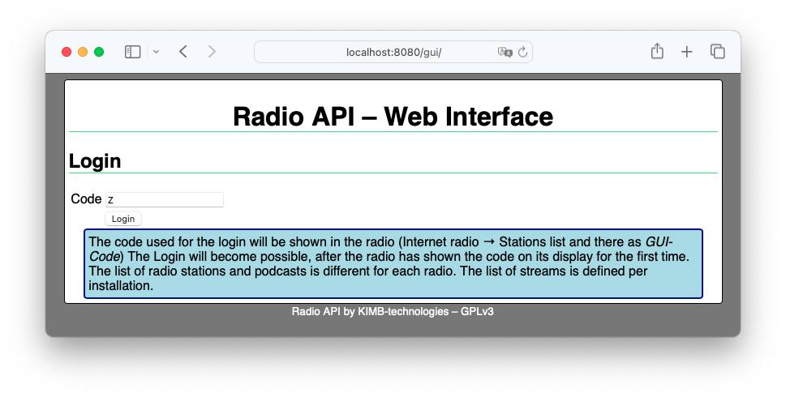
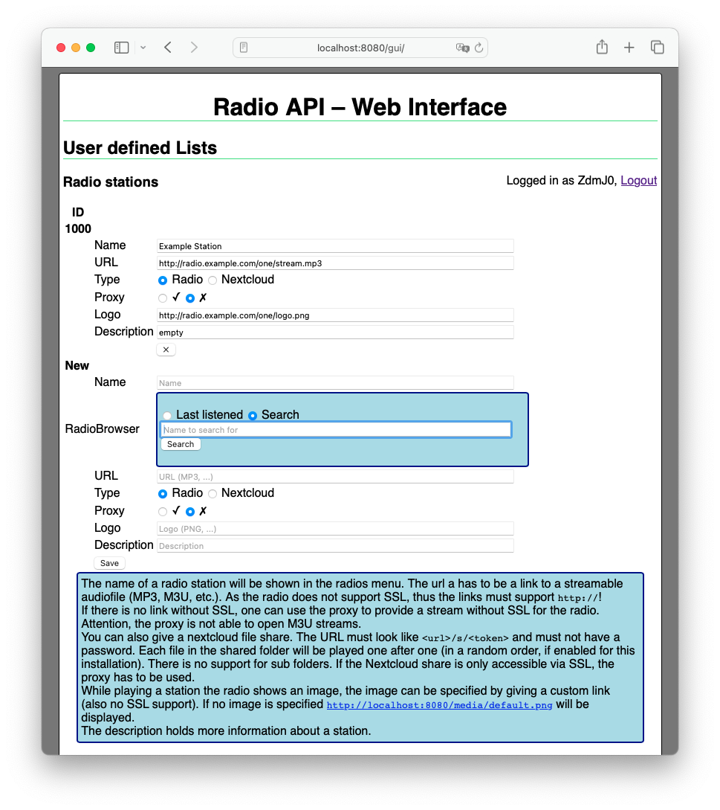
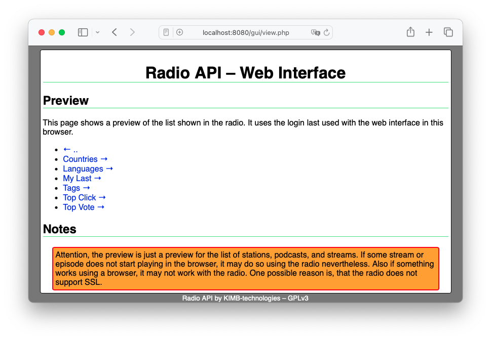

## Screenshots of the Web Interface (GUI) of Radio-API

The GUI is used to manage radio stations and podcasts.
It also provides a preview of the items shown in the radio's display.

### Login
> `https(s)://radio.example.com/gui/`

### Edit Podcasts or Radio Stations
> `https(s)://radio.example.com/gui/`

### Preview
> `https(s)://radio.example.com/gui/viewer.php` (or the bottom of the edit podcasts or radio stations page)

